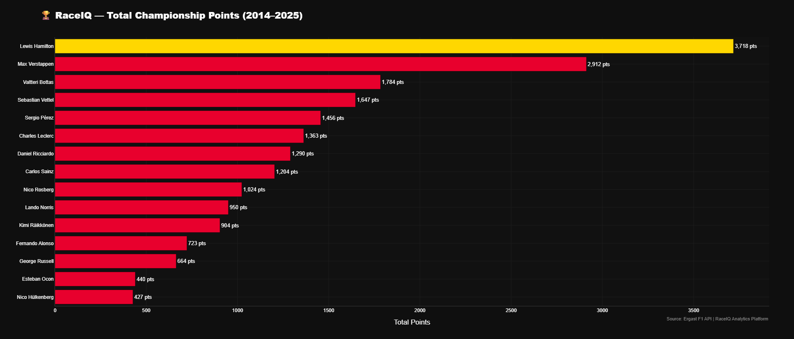
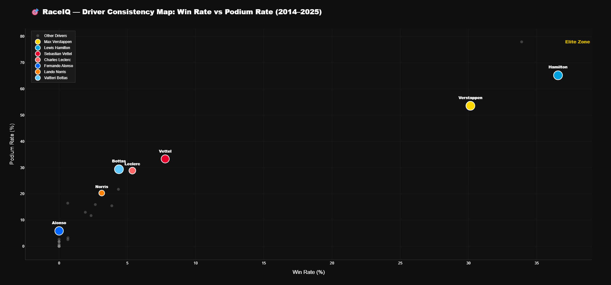
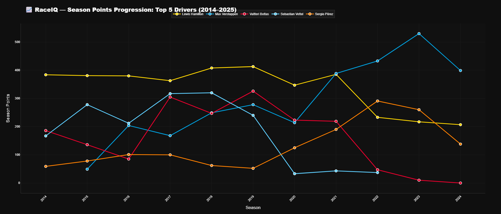
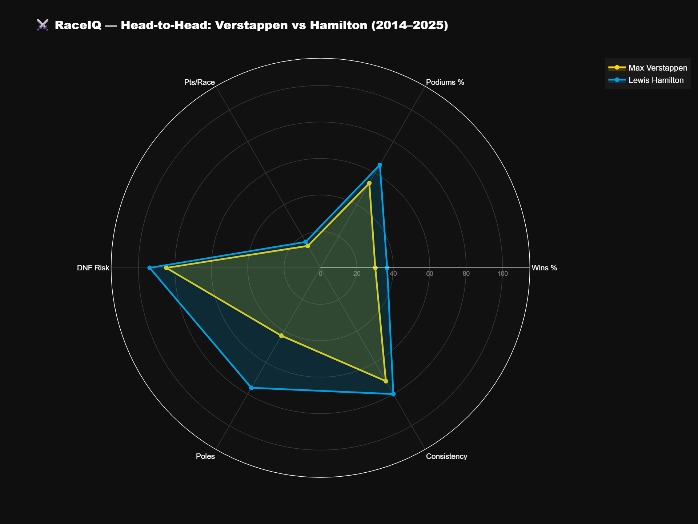
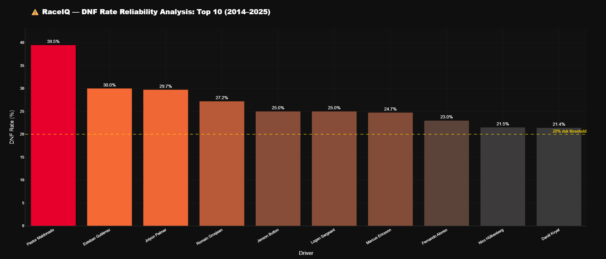

<div align="center">

# 🏎️ RaceIQ — Formula 1 Strategy Intelligence Platform

[](https://python.org)
[](https://pandas.pydata.org)
[](https://plotly.com)
[](https://streamlit.io)
[](https://jupyter.org)
[](LICENSE)

**RaceIQ is a Formula 1 Strategy Intelligence Platform designed to transform historical race data into actionable insights for performance analysis, race strategy evaluation, and decision support.**

*Designed for Team Principals, Race Engineers, and Strategy Engineers.*

</div>

---

## 🎯 Overview

RaceIQ transforms raw F1 race data from the **Ergast F1 API** into a comprehensive analytics platform. By analyzing 12 seasons (2014–2025) of hybrid-era Formula 1, RaceIQ provides data-backed intelligence that mirrors the decision-making frameworks used by real F1 strategy teams.

> *"Data tanpa insight hanyalah angka. RaceIQ mengubah angka menjadi keputusan."*
> 
> *— "Data without insight is just numbers. RaceIQ turns numbers into decisions."*

---

## 📦 Modules Roadmap

| Module | Focus | Status |
|--------|-------|--------|
| **01** | Driver Performance Analytics | ✅ Complete |
| **02** | Constructor & Team Analytics | ✅ Complete |
| **03** | Race Strategy & Pit Stop Analysis | 🔄 Upcoming |
| **04** | Qualifying & Grid Position Analysis | 🔄 Upcoming |
| **05** | Championship Trends & Predictions | 🔄 Upcoming |

---

## 📁 Project Structure

```
RaceIQ/
├── data/
│   ├── raw/                    ← Ergast F1 CSV dataset (not pushed to Git)
│   └── processed/              ← Cleaned & merged datasets (.parquet)
├── notebooks/
│   └── 01_driver_performance.ipynb   ← Module 1: Full EDA notebook
├── dashboard/
│   └── streamlit/
│       └── app.py              ← Interactive Streamlit dashboard
├── assets/
│   └── images/                 ← Exported PNG visualizations (1920×1080)
├── docs/                       ← Documentation
├── sql/                        ← SQL queries (future modules)
├── src/
│   └── create_notebook.py      ← Notebook generator script
├── README.md
├── requirements.txt
└── .gitignore
```

---

## ⚡ Quick Start

### 1. Clone the Repository

```bash
git clone https://github.com/yourusername/RaceIQ.git
cd RaceIQ
```

### 2. Install Dependencies

```bash
pip install -r requirements.txt
```

### 3. Add the Dataset

Download the [Ergast F1 Dataset from Kaggle](https://www.kaggle.com/datasets/rohanrao/formula-1-world-championship-1950-2020) and place all CSVs in `data/raw/`.

### 4. Run the Streamlit Dashboard

```bash
streamlit run dashboard/streamlit/app.py
```

### 5. Open the Jupyter Notebook

```bash
jupyter notebook notebooks/01_driver_performance.ipynb
```

---

## 🔍 Module 1 — Key Findings

> **Driver Performance Analytics (2014–2025 Hybrid Era)**

- 🏆 **Win Rate > Raw Wins:** Max Verstappen's win rate (35%+) exceeds Hamilton's even though Hamilton has more career wins — win rate is the superior metric for driver valuation and contract negotiation.

- 📍 **Pole Doesn't Guarantee the Win:** ~50–65% of pole sitters finish on the podium, but ~15–20% fail to finish in the top 5. Race strategy and tyre management matter more than qualifying pace alone.

- ⚡ **Overperformers = Hidden Gems:** Midfield drivers who gain 2+ positions per race consistently outperform their car's pace — these drivers are premium assets for teams in development phases, offering elite performance at below-top-tier salary.

- ⚠️ **DNF Rate is an Underused Metric:** Drivers with >20% DNF rates significantly underperform their raw pace in championship standings. This is a critical risk factor for teams targeting constructor points over individual race wins.

- 🌍 **National Academy ROI:** British and Dutch drivers dominate race wins in this era — Hamilton (Mercedes/British) and Verstappen (Red Bull/Dutch). This mirrors long-term investment in national F1 academies and scouting pipelines.

---

## 🔍 Module 2 — Key Findings

> **Constructor & Team Analytics (2014–2025 Hybrid Era)**

- 🚀 **Momentum Matters:** Teams like McLaren and Aston Martin showed that aggressive mid-season development can drastically alter the competitive landscape, jumping from midfield to front-runners in a single season.
- ⏱️ **Pit Crew Efficiency Wins Championships:** Red Bull's dominance is mathematically supported by their unmatched pit stop efficiency. Consistently fast pit stops translate directly into track position advantages.
- 🔥 **Eras of Dominance:** Heatmap and market share analysis clearly visualize the distinct "eras" of F1: Mercedes' hybrid-era dominance followed by Red Bull's ground-effect era mastery. Recognizing these shifts is crucial for team investment strategies.

---

## 📊 Dashboard Preview

### Driver Performance Overview


### Consistency Map


### Points Progression


### Head-to-Head Radar


### DNF Reliability


---

## 🛠️ Tech Stack

| Component | Technology | Purpose |
|-----------|-----------|---------|
| **Data Processing** | Pandas, NumPy | ETL, feature engineering |
| **Visualization** | Plotly | Interactive charts |
| **Dashboard** | Streamlit | Web app |
| **Analysis** | Jupyter Notebook | EDA & documentation |
| **Data** | Ergast F1 API (Kaggle) | Historical F1 race data |
| **Export** | Kaleido | Static PNG rendering |

### Design System
| Token | Value | Usage |
|-------|-------|-------|
| Background | `#0F0F0F` | Main dark background |
| Card | `#1A1A1A` | Chart/card background |
| Primary | `#E8002D` | Ferrari Red — accent |
| Highlight | `#FFD700` | DRS Gold — champion highlight |
| Text | `#FFFFFF` | Primary text |

---

## 📋 Dataset

**Source:** [Ergast F1 API — Formula 1 World Championship (1950–2024)](https://www.kaggle.com/datasets/rohanrao/formula-1-world-championship-1950-2020)

**Module 1 Primary Tables:**

| File | Rows | Description |
|------|------|-------------|
| `drivers.csv` | ~863 | Driver biographical data |
| `results.csv` | ~26,700 | Race-by-race results |
| `races.csv` | ~1,100 | Race schedule & metadata |
| `driver_standings.csv` | ~34,000 | Championship standings |
| `constructors.csv` | ~212 | Team information |
| `status.csv` | ~140 | Finish status codes |

---

## 🚀 Future Modules

**Module 3 — Race Strategy & Pit Stops**
- Pit stop timing and duration analysis
- Undercut/overcut strategy effectiveness
- Safety car impact on race outcomes

**Module 4 — Qualifying Intelligence**
- Q1/Q2/Q3 lap time progression
- Qualifying vs race pace correlation
- Grid penalty impact analysis

**Module 5 — Championship Predictions**
- Machine learning-based championship outcome prediction
- Points probability modeling per race
- Season forecast under different scenarios

---

## 👤 Author

Built as a professional data analytics portfolio project by **Nugraha**.

*"This is my personal project — analyzing F1 through data because racing and data science are the two coolest things in the world."*

---

<div align="center">

**RaceIQ © 2025 | Data: Ergast F1 API | Built with Python & Streamlit**

*Module 1: Driver Performance Analytics ✅ | Module 2: Constructor Analytics ✅*

</div>
